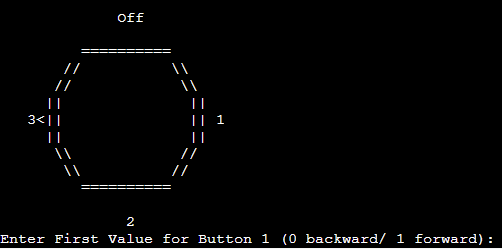

# Fan Simulation in FSM
## Brief Description
This code is a simulation of a fan's dial with 4 states which are off, speed 1, speed 2, and speed 3. Due to the nature of a dial the states can move back and forth. For example speed off can only go to speed 1 or speed 3 but cannot go to speed 2.
## Finite State Machine Graph

The graphs shows the 4 states and how they move from one another, with buttons -> being forward, and <- being backwards. The state also dont change when any button is pressed.
## K-Map Truth Table

## K-Map Boolen Expressions

## Output
### State 1

### State 2

### State 3

### State 4

