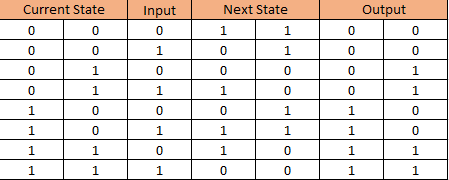

# Fan Simulation in FSM
## Brief Description
This code is a simulation of a fan's dial with 4 states which are off, speed 1, speed 2, and speed 3. Due to the nature of a dial the states can move back and forth. For example speed off can only go to speed 1 or speed 3 but cannot go to speed 2.
## Finite State Machine Graph

The graphs shows the 4 states and how they move from one another, with buttons -> being forward, and <- being backwards. The state also dont change when any button is pressed. Each state also has a corresponding number attached to it being 00 for off, 01 for speed 1, 10 for speed 2, and 11 for speed 3. Each state has the same output value as the attached state numbers.
## K-Map Truth Table

With all the values from the FSM graph it is able to be converted to a truth table using each current state, inputs, next state, and output. current state and ouputs have the same value while inputs and next state depends on the graph from before with it we can determined all the values some values are d values as they dont appear in the finite state graph from before.
## K-Map Boolen Expressions

After working out the truth table from before we can create boolen expressions for the next state and the outputs based on the current state and inputs for each column. which resolted in the upper 4 tables. With 1, 0, and d values based on the inputs and current state of each. We then make the boolen expressions for each table which resulted in these equations :

S0 = X1'X3 X4' + X2'X3 X4 + X2 X3'X4 + X1 X3'X4'

S1 = X1'X2'X4 + X2 X4' + X1 X4'

O0 = X1

O1 = X2

with ' being a negation value, X1 and X2 for the input values, and X3 and X4 for the current state values.
## Output
Now in C code the machine works as intended with 2 input values one being for button 1 and the second being for button 2 in the C code these data values are input1 and input2. These inputs work in the same way as in the first finite state machine graph that being when 01 is pressed it moves forward and if 10 is pressed it will go backwards. This is also true for 00 where nothing will happen. For each state refer to the images below.
### State 1

### State 2

### State 3

### State 4

